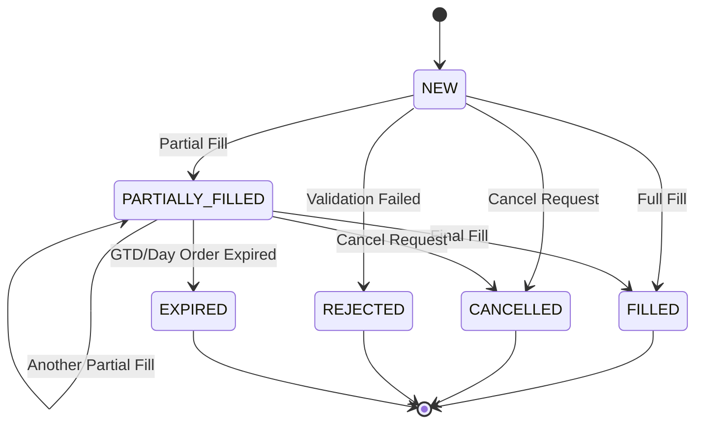
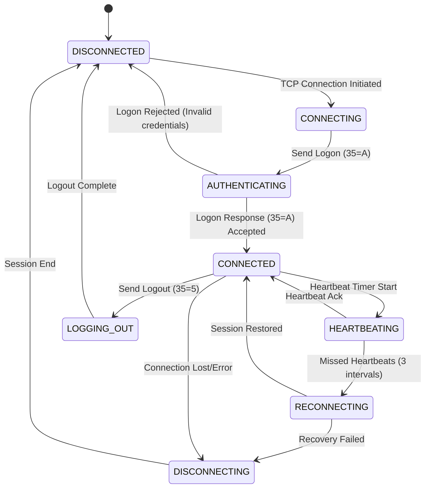
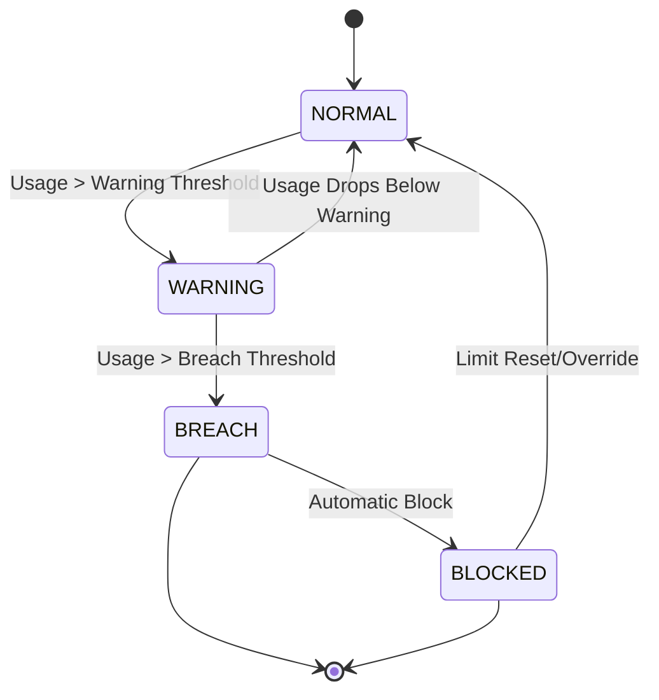

# LME State Machines Reference

# Order State Machine
## Order Status Values

| Status | Code | Description | Source |
|-------|------|-------------|--------|
| NEW | 0 | Order accepted, not yet executed | FIX Spec §4.11.3 |
| PARTIALLY_FILLED | 1 | Partially executed | FIX Spec §4.11.3 |
| FILLED | 2 | Fully executed | FIX Spec §4.11.3 |
| CANCELLED | 4 | Cancelled by user or system | FIX Spec §4.11.3 |
| REJECTED | 8 | Rejected by gateway | FIX Spec §4.11.3 |
| EXPIRED | C | Expired (TimeInForce/GTD expired) | FIX Spec §4.11.3 |

## Order State Diagram

**Source**: FIX Spec §4.11.3

---

# Session State Machine
## Session Status Values

| Status | Code | Description | Source |
|-------|------|-------------|--------|
| DISCONNECTED | - | No TCP connection | FIX Spec §1.4 |
| CONNECTING | - | TCP connection in progress | FIX Spec §1.4 |
| AUTHENTICATING | - | Logon message sent, awaiting response | FIX Spec §1.4 |
| CONNECTED | - | Session authenticated, ready for messages | FIX Spec §1.4 |
| LOGGING_OUT | - | Logout message sent, awaiting confirmation | FIX Spec §1.4 |
| DISCONNECTING | - | Session termination in progress | FIX Spec §1.4 |

## Session State Diagram

**Source**: FIX Spec §1.4

---

# Risk State Machine
## Risk Management States

| State | Code | Description | Source |
|-------|------|-------------|--------|
| NORMAL | 0 | Within all risk limits | Risk Spec §3.2 |
| WARNING | 1 | Approaching limit threshold | Risk Spec §3.2 |
| BREACH | 2 | Exceeded risk limit | Risk Spec §3.2 |
| BLOCKED | 3 | Trading blocked due to risk breach | Risk Spec §3.2 |

## Risk State Diagram

**Source**: Risk Spec §3.2
