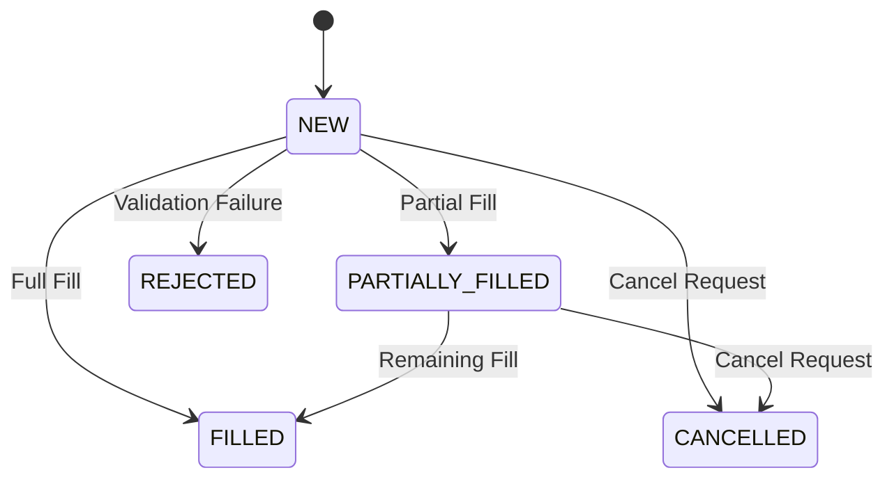

## Context

The LME options trading requirements documentation (`doc/requirements/`) was created through LLM-assisted extraction from 5 source PDF specifications. A comprehensive gap analysis identified systematic quality issues across all 36 message specifications and 7 functional modules.

### Current State

**Source Material (authoritative)**:
- `doc/requirements/docs/specs/Order Entry Gateway FIX Specification v 1 9 1.md` (9,033 lines)
- `doc/requirements/docs/specs/Binary Order Entry Specification v1 9  1.md`
- `doc/requirements/docs/specs/Risk Management Gateway FIX Specification v1 8.md`
- `doc/requirements/docs/specs/LME Matching Rules August 2022.md`
- `doc/requirements/docs/specs/LMEselect v10 FIX and BINARY Message Examples v10.md`

**Derived Specifications (incomplete)**:
- 36 message specs in `openspec/messages/organized/`
- 7 module specs in `openspec/specs/*/`

### Key Findings from Gap Analysis

| Category | Finding | Impact |
|----------|---------|--------|
| **Empty specs** | 6 FIX messages contain only header fields (F, G, 9, s, q, r) | Cannot implement without source spec lookup |
| **Placeholders** | 8 Binary messages have "*Field definitions to be extracted*" text | No implementation guidance |
| **Missing fields** | 18 Risk messages missing application-specific fields | Incomplete business logic |
| **Vague values** | Specs use "configurable", "see section X.Y.Z", "must be validated" | Not self-contained |
| **Template tests** | All test.md files are placeholders | No test case guidance |

### Constraints

- Must remain traceable to source specifications
- Cannot introduce values not in authoritative sources
- Must maintain existing file structure
- Changes are documentation-only (no code impact)

## Goals / Non-Goals

**Goals:**

1. **Self-containedness**: Every spec file contains all information needed for implementation without external lookups
2. **Concrete values**: Replace all vague terms with specific numeric values, symbol lists, and enumerations
3. **Formal state definitions**: Add state machine diagrams for session, order, and risk lifecycles
4. **Complete test coverage**: Replace test templates with actual test cases with specific data values

**Non-Goals:**

- Adding new requirements not in source specifications
- Changing the existing directory structure
- Creating executable test code (specs remain documentation)
- Addressing performance or technical architecture concerns
- Fixing source specification issues (we can only improve derived specs)

## Decisions

### Decision 1: Reference File Strategy

**Decision**: Create dedicated reference files for cross-cutting data instead of duplicating in each message spec.

**Rationale**: 
- Symbol list, trading hours, error codes appear in 20+ messages
- Single source of truth easier to maintain
- Message specs can link to reference files

**Alternatives Considered**:
- Inline all values in each message spec → Rejected: Duplication, maintenance burden
- Create a database/JSON file → Rejected: Harder to review, less accessible

**Implementation**:
```
doc/requirements/openspec/reference/
├── symbols.md           # LME symbol list with lot sizes, tick sizes
├── trading-hours.md     # Trading hours by venue and session
├── error-codes.md       # Complete error/rejection code catalog
├── state-machines.md    # State machine definitions
└── validation-rules.md  # Field validation rule catalog
```

### Decision 2: Message Spec Completion Priority

**Decision**: Process message specs in priority order based on gap severity.

**Priority Order**:
1. **P0 (Critical)**: 6 empty FIX messages (F, G, 9, s, q, r) - Block implementation
2. **P1 (High)**: 8 Binary messages with placeholders - No field definitions
3. **P2 (Medium)**: 18 Risk Management messages - Missing application fields
4. **P3 (Low)**: Remaining FIX messages - Need concrete value enrichment

**Rationale**: Empty specs provide zero implementation value, must be addressed first.

### Decision 3: State Machine Notation

**Decision**: Use Mermaid stateDiagram-v2 syntax for state machine definitions.

**Rationale**:
- Renderable in GitHub, Markdown editors
- Standard notation familiar to developers
- Can be validated programmatically

**Example**:


### Decision 4: Concrete Value Extraction Approach

**Decision**: Extract values directly from source specifications with section references.

**Format**: Each concrete value includes source citation:
```markdown
| Parameter | Value | Source |
|-----------|-------|--------|
| Heartbeat Interval | 30 seconds | FIX Spec §1.4 |
| Session Timeout | 3 heartbeat intervals (90 seconds) | FIX Spec §1.4 |
| Max Order Qty | 9,999 lots | FIX Spec §3.3 |
| Trading Hours | 01:00-19:00 London time | Matching Rules §4 |
```

**Rationale**: Traceability to authoritative source enables verification.

### Decision 5: Test Case Structure

**Decision**: Each test.md file follows a consistent structure with specific test case IDs.

**Structure**:
```markdown
## Test Cases

### TC-{MODULE}-{001}: {Test Name}

| Field | Value |
|-------|-------|
| **ID** | TC-ORDER-001 |
| **Type** | Positive/Negative/Edge |
| **Description** | Submit valid limit order |
| **Preconditions** | Session authenticated, market open |

**Input:**
| Field | Value |
|-------|-------|
| Symbol | CU |
| Side | 1 (Buy) |
| OrderQty | 10 |
| OrdType | 2 (Limit) |
| Price | 8500.00 |

**Expected Output:**
| Field | Value |
|-------|-------|
| ExecType | 0 (New) |
| OrdStatus | 0 (New) |
```

**Rationale**: Consistent structure enables automated test generation in future.

## Risks / Trade-offs

### Risk 1: Source Spec Interpretation

**Risk**: LLM extraction may misinterpret source specification intent.

**Mitigation**: 
- Include source section references for all extracted values
- Flag ambiguous cases in Open Questions
- Review against original PDF if needed

### Risk 2: Incomplete Source Coverage

**Risk**: Source specs may not contain all needed concrete values.

**Mitigation**:
- Use domain knowledge for LME-standard values (lot sizes, tick sizes)
- Mark inferred values with `[inferred]` tag
- Document gaps in Open Questions

### Risk 3: Maintenance Drift

**Risk**: Derived specs may diverge from source if source is updated.

**Mitigation**:
- Include version number and date from source specs
- Add "Last Synced" metadata to each derived spec
- Document sync process in reference files

### Risk 4: Scope Creep

**Risk**: Effort to complete all 36 message specs + 7 modules is significant.

**Mitigation**:
- Focus on P0 (empty specs) first
- Incremental delivery - each completed spec provides value
- Track progress with task checklist

## Migration Plan

### Phase 1: Foundation (Reference Files)

1. Create `openspec/reference/` directory
2. Create `symbols.md` with complete LME symbol list
3. Create `trading-hours.md` with venue schedules
4. Create `error-codes.md` with complete code catalog
5. Create `state-machines.md` with session, order, risk diagrams
6. Create `validation-rules.md` with field rule catalog

### Phase 2: Critical Message Specs (P0)

Process 6 empty FIX messages:
1. F-Order-Cancel-Request.md
2. G-Order-Cancel-Replace-Request.md
3. 9-Order-Cancel-Reject.md
4. s-New-Order-Cross.md
5. q-Order-Mass-Cancel-Request.md
6. r-Order-Mass-Cancel-Report.md

For each:
- Extract all fields from source spec Section 4.11
- Add concrete values with source references
- Add business rules with section references
- Add test case examples

### Phase 3: Binary Message Specs (P1)

Process 8 Binary messages:
1. Replace placeholder text with actual field definitions
2. Add binary encoding rules
3. Add message structure diagrams
4. Add test case examples

### Phase 4: Risk Management Specs (P2)

Process 18 Risk Management messages:
1. Add missing application fields
2. Add party detail group structures
3. Add risk limit methodology
4. Add MMP protection formulas

### Phase 5: Value Enrichment (P3)

Process remaining FIX messages:
1. Add concrete symbol list references
2. Add quantity/price limit values
3. Add complete field enumerations
4. Add business rule references

### Phase 6: Module Specs

Process 7 module specs:
1. Add concrete numeric values
2. Add state machine references
3. Add validation rule references
4. Replace test templates with actual test cases

## Open Questions

1. **LME Symbol List Completeness**: The analysis found symbols CA, PB, ZS, AL, NI, SN, AA, HN. Is this the complete list for LMEselect options on futures, or are there additional contracts?

2. **Binary Protocol Version**: Source spec references Binary v1.9.1 - should we document any version-specific behaviors?

3. **Trading Hours Exceptions**: Matching Rules mention "see lme.com" for Ring trading hours. Should we hardcode or reference external calendar?

4. **Error Code Extensions**: LME uses extended error codes beyond standard FIX. Should these go in a separate LME-specific catalog?

5. **Test Case Automation**: Should test cases be structured for potential automated generation, or remain purely documentation?
